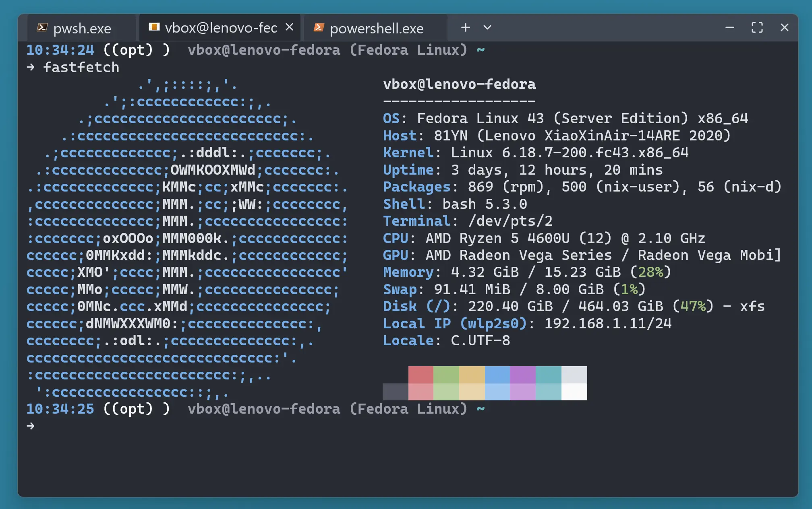

# KazeTerm

## Under development

A lightweight cross-platform terminal app based on Alacritty, inspired by Windows Terminal.

## Screenshot



## How to Build

### Environment Setup

#### Windows

MSVC target is required.

#### Fedora

```
dnf install -y \
  clang \
  llvm \
  libxcb-devel \
  libxkbcommon-devel \
  libxkbcommon-x11-devel
```

#### Ubuntu

```
apt install -y \
  clang \
  llvm \
  libxcb1-dev \
  libxkbcommon-dev \
  libxkbcommon-x11-dev
```

#### macOS
No special requirements are needed.

### Run Build Commands

For debug build, run:

```
cargo build
```

For release build, run:

```
cargo build --release
```

On Windows, debug symbols are stored in PDB files, and on Linux they are in the binary.
To strip symbols from the binary, run:

```
llvm-objcopy --strip-all ./target/release/kazeterm
```

## Testing and Coverage

Run all unit tests:

```
cargo test --workspace
```

Generate coverage (requires `cargo-llvm-cov`):

```
cargo llvm-cov --workspace --all-features --lcov --output-path coverage/lcov.info
```

This produces `coverage/lcov.info`.

## License

- Some code is derived from Zed; this code inherits Zed's GPL-v3 license.

- The bundled Cascadia Code fonts follow the SIL Open Font License.

- The bundled lucide icons follows original MIT license.

