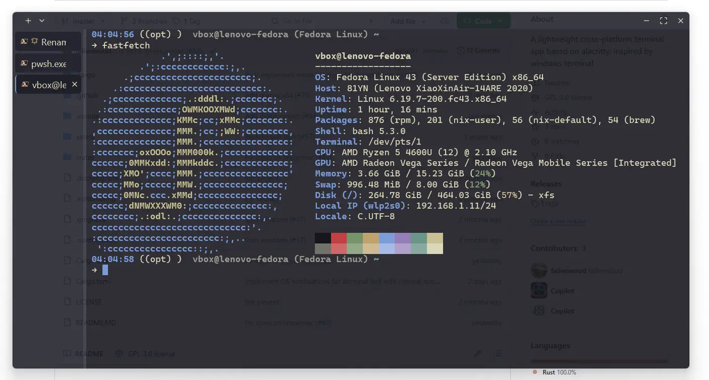

# KazeTerm

## Under development

A lightweight cross-platform terminal app based on Alacritty, inspired by Windows Terminal.

## Screenshot



## Documentation
More details can be found at [wiki](https://github.com/fallenwood/kazeterm/wiki "")

## Visual settings

Choose **Settings** in the new-tab dropdown menu to open the settings page in the
current window. The sidebar groups startup, appearance, fonts, tabs, panes,
terminal, cursor, notifications, animation, and update settings. Profiles,
shortcuts, environment variables, and ordered config imports also have visual
editors. Running terminal sessions stay alive while you edit.

Use **Save** (Ctrl+S / Cmd+S) to write changes and immediately apply them through
the same hot-reload path used for external config edits, without closing the
settings page or restarting terminals. Use **Revert changes** to discard the
draft, or **Back to terminal** to return. Leaving with unsaved changes asks for
confirmation. **Reload file** reads external edits; saving refuses to overwrite
a file that changed since it was loaded. **Open TOML file** remains available.
Numeric fields reject invalid characters while typing or pasting, allowing whole
numbers or decimals as appropriate. Completed values are range-checked on save.
Dropdown lists and menus grow with their content up to the available window
height, leaving a small edge margin. They scroll only when the content does not fit.

The editor shows the **base file**, not the merged configuration. Imported files
keep their higher priority and are never modified by the editor. Theme, fonts,
keybindings, and other live settings update in all open windows after saving.
Settings explicitly marked for new windows/sessions retain that behavior.
Saving normalizes TOML formatting and does not preserve comments.

## Config Overlays

Kazeterm loads `kazeterm.toml` as the base config and can merge extra TOML files listed in `imports`.
Imported files have higher priority than the base file, and later imports override earlier ones.

```toml
imports = ["~/kazeterm.windows.toml"]
```

Relative import paths are resolved from the file that declares them, and nested imports are supported.

### Themes

Theme files in `assets/themes/*.toml` are seed-based. Most UI colors are derived from:

- `background`
- `foreground`
- `accent`
- `border`
- ANSI `black`..`white` plus optional `bright_*`

Kazeterm also supports a small set of optional semantic overrides when the derived defaults are not enough:

- `cursor`
- `overlay`
- `selection`
- `search_match`
- `search_highlight`

### Terminal kernel

Terminal backends are selected through the terminal kernel abstraction:

```toml
[terminal]
kernel = "alacritty"
```

Supported values are `alacritty` (default) and `vte` (Linux only). Unsupported kernels fail explicitly instead of silently falling back.

### Key debug overlay

Enable the bottom-right shortcut inspector with:

```toml
[window]
key_debug_mode = true
```

### Transition animations

Structural UI changes share one transition configuration. Creating or switching
tabs does not fade the terminal. Set `enabled = false` to apply changes immediately.

```toml
[animation]
enabled = true
duration_ms = 180
frame_interval_ms = 15
# Supported values: "linear", "ease_in", "ease_out", "ease_in_out"
easing = "ease_in_out"
fade_start_opacity = 0.82
```

`duration_ms` is capped at 5000 ms, `frame_interval_ms` is clamped to 4–1000 ms,
and `fade_start_opacity` is clamped to 0–1.

### Auto update

Kazeterm can check GitHub releases and apply matching packages for the current
platform:

```toml
[auto_update]
# Supported values: "never", "once_a_day", "always"
check = "once_a_day"
# Optional; omit when no proxy is needed.
proxy = "http://127.0.0.1:7890"
```

Local/dev builds always skip auto-update checks. CI-packaged pinned builds such
as `0.1.0` ignore the `wip` release and update only to the latest pinned tag.
CI-packaged `wip` builds track the `wip` release by commit hash or release
timestamp. Updates are staged in the system temp directory; Kazeterm saves the
workspace, swaps the executable on restart, and restores the saved workspace.
Updater state, including the daily-check timestamp and one-shot restore flag, is
kept in the same `kazeterm.toml` under `[auto_update]`.

## How to Build

### Environment Setup

#### Windows

MSVC target is required for release build.

#### Fedora

```
dnf install -y \
  clang \
  llvm \
  libxcb-devel \
  libxkbcommon-devel \
  libxkbcommon-x11-devel
```

#### Ubuntu

```
apt install -y \
  clang \
  llvm \
  libxcb1-dev \
  libxkbcommon-dev \
  libxkbcommon-x11-dev
```

#### macOS

XCode is needed for metal sdk

```
xcode-select --switch /Applications/Xcode.app/Contents/Developer
xcodebuild -runFirstLaunch
xcodebuild -downloadComponent MetalToolchain
```

### Run Build Commands

For debug build, run:

```
cargo build
```

For release build, run:

```
cargo build --release
```

On Windows, debug symbols are stored in PDB files, and on Linux they are in the binary.
To strip symbols from the binary, run:

```
llvm-objcopy --strip-all ./target/release/kazeterm
```

## Testing and Coverage

Run all unit and integration tests:

```
cargo test --workspace
```

### UI test coverage

Kazeterm's GPUI-based UI is exercised headlessly via `gpui`'s `test-support`
feature (enabled as a dev-dependency on the `kazeterm` crate):

- **Component tests** live next to the components they exercise
  (`crates/kazeterm/src/components/*_dialog.rs`, `search_bar.rs`, …) and use
  `#[gpui::test]` with a shared helper in `crates/kazeterm/src/test_support.rs`
  that installs a default `Config` + `SettingsStore` for each test window.
- **Keybinding regression tests** in
  `crates/config/tests/default_keybindings.rs` lock down the default bindings
  shipped with `KeybindingConfig::default()`.
- **Event-protocol tests** in
  `crates/kazeterm-event-system/tests/json_event_protocol.rs` guard the
  stdin/socket JSON wire format.
- **Headless terminal tests** in `crates/terminal/tests/headless_terminal.rs`
  drive an in-memory `alacritty_terminal::Term` through the ANSI parser — no
  PTY, no child process — and assert on the resulting grid. This is the
  foundation for behavioural testing of escape-sequence handling.
- **Snapshot tests** in `crates/terminal/tests/snapshot_grid.rs` use
  [`insta`](https://insta.rs) to snapshot rendered grids for a set of canned
  ANSI scenarios. Run `cargo insta review --workspace` to accept intentional
  changes; set `INSTA_UPDATE=always` when bulk-regenerating.
- **End-to-end tests** in
  `crates/kazeterm/src/components/main_window_e2e_tests.rs` boot a real
  `MainWindow` against a fake terminal-session factory
  (`terminal::test_support::fake_terminal_session`). They verify that
  `insert_new_tab` wires through to the factory and that `MainWindow.items`
  is updated. No child process is ever spawned.

Running just the UI-level tests:

```
cargo test --package kazeterm --bin kazeterm
cargo test --package config --test default_keybindings
cargo test --package kazeterm-event-system --test json_event_protocol
cargo test --package terminal --test headless_terminal
cargo test --package terminal --test snapshot_grid
cargo test --package terminal --test fake_session
```

End-to-end tests now boot `MainWindow` against a fake session factory (see
`crates/kazeterm/src/components/main_window_e2e_tests.rs`). The only remaining
layer is optional GPU visual snapshots, which are deliberately not shipped
(documented in plan.md under "Still not shipped").

Generate coverage (requires `cargo-llvm-cov`):

```
cargo llvm-cov --workspace --all-features --lcov --output-path coverage/lcov.info
```

This produces `coverage/lcov.info`.

## License

- Some code is derived from Zed; this code inherits Zed's GPL-v3 license.

- The bundled Cascadia Code fonts follow the SIL Open Font License.

- The bundled lucide icons follows original MIT license.
